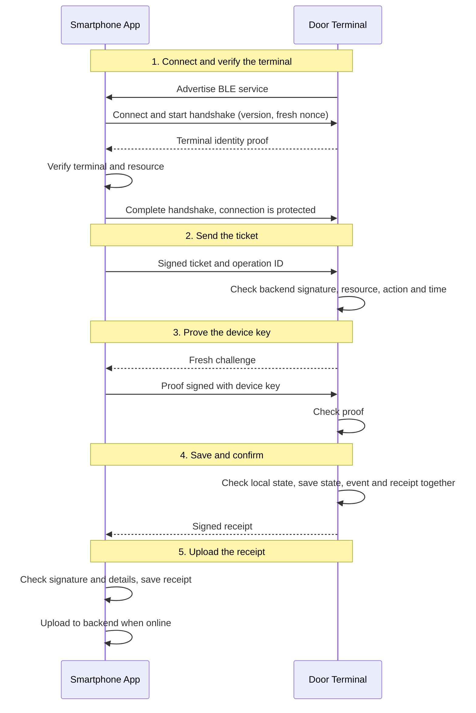
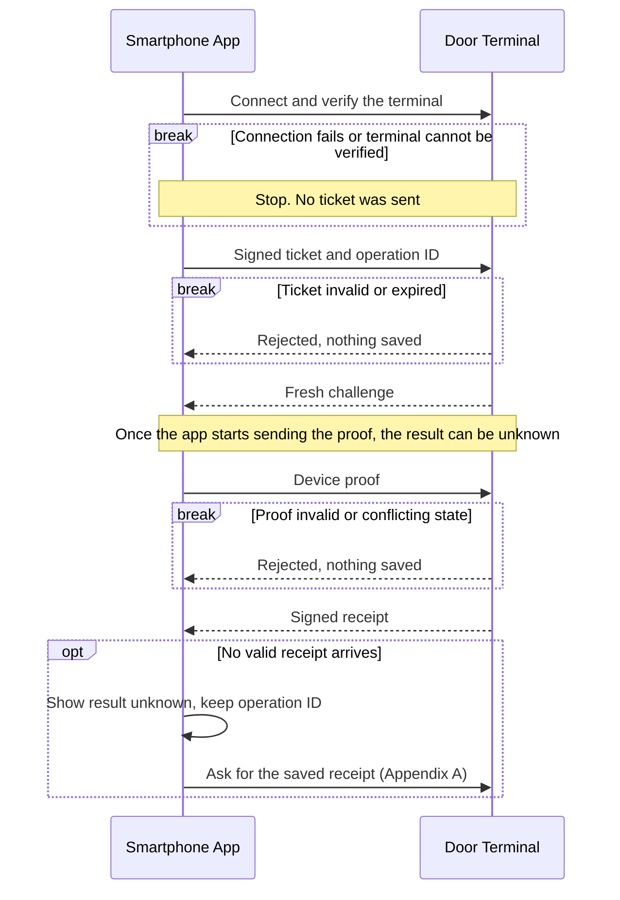
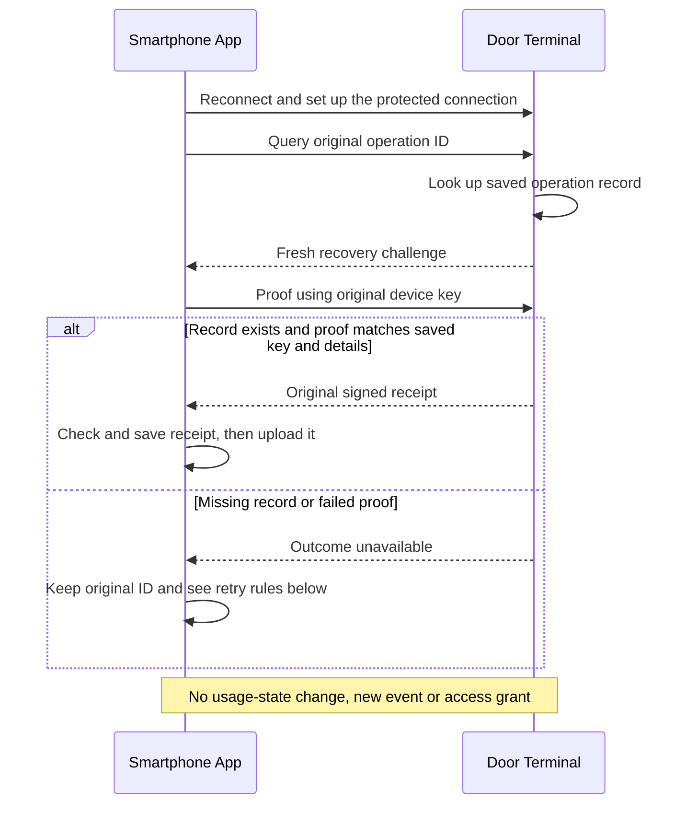

# BLE Communication Flow

Status: Sprint 1 design proposal for [issue #3 (T-003)](https://github.com/thomas-sartini/ble-booking-system/issues/3), ready for team review.

## 1. Purpose and scope

This concept describes how the mobile app on the smartphone communicates with the door terminal over BLE to authorize access and record check-in/check-out. The terminal is assigned to the booked resource. The flow follows the backend's ticket approach.

### The idea in short

Before check-in, the app fetches a signed ticket from the backend. The terminal can check this ticket completely offline. With a challenge-response step, the app proves that it holds the matching private key, so simply copying the ticket to another smartphone is not enough. If everything succeeds, the terminal saves the event and issues a signed receipt, which the app uploads to the backend. Check-out works the same way, with its own ticket.

**Not in scope:** BLE and firmware implementation, mobile classes, final data formats and cryptographic algorithms, detailed synchronization, and performance optimization.

## 2. Actors and prerequisites

Three parties are involved. Only the first two take part in the BLE exchange.

| Actor | Role |
|---|---|
| Mobile app on the smartphone | BLE central / GATT client. Verifies the terminal, sends the ticket, proves the device key, and uploads receipts. |
| Door terminal (assumed ESP32) | BLE peripheral / GATT server. Checks tickets offline, saves events, and returns signed receipts. |
| Backend | Registers devices, issues tickets, and processes receipts. It takes no part in the BLE exchange. |

Before a check-in or check-out can start, four things must be in place:

1. The smartphone has a registered key pair. The private key stays in protected storage; the backend links the public key to the user.
2. The app holds a backend-signed ticket for this device key, booking, resource, action, and time window.
3. The terminal knows its terminal and resource IDs and the backend's verification key. It has its own signing key, a reliable clock, and storage that survives a restart.
4. The app has trusted information to verify the terminal.

The terminal never needs a name or email. It only checks the ticket and the device's proof. BLE advertising and addresses help the app find the terminal, but they do not prove identity.

Before issuing a ticket, the backend checks the user's role, booking ownership, and account/device status. In the proposed backend flow, only the booking owner can check in or out with their registered device.

Open design decisions are summarized in section 6.

## 3. Normal flow: check-in and check-out

Check-in and check-out use the same exchange. Each needs its own ticket.

### 3.1 The five steps

1. **Connect and verify the terminal.** The app finds the terminal over BLE and connects. The terminal proves that it is the trusted terminal for this resource, and both sides set up a protected connection. *Message: handshake and terminal proof.*
2. **Send the ticket.** The app sends the signed ticket and an operation ID. The terminal checks the backend signature, resource, action, and time window. *Message: authorization request.*
3. **Prove the device key.** The terminal sends a fresh challenge, and the app signs it with the device key named in the ticket. *Messages: challenge and device proof.*
4. **Save and confirm.** The terminal checks its local state, saves the event, and returns a signed receipt. Only then may it signal access. *Message: signed receipt, or an error result.*
5. **Upload the receipt.** The app checks the terminal's signature and that the receipt matches its own request. It saves the receipt and uploads it when it is online. The backend then updates the booking status.

Under the backend's ticket proposal, a check-out ticket is issued only after the backend has accepted the check-in receipt. The upload in step 5 is therefore required to obtain that ticket.

The message names describe purposes, not final names or formats. GATT characteristics, UUIDs, framing, and packet sizes are left for implementation.

### 3.2 What the terminal checks and saves

| Action | Required local state | Result |
|---|---|---|
| `CHECK_IN` | The booking may start. No conflicting use, and this booking was not started before. | One start event. The booking is in use. |
| `CHECK_OUT` | The same booking is currently in use. | One end event. The use is ended. |

The terminal follows three rules:

- **One request at a time.** It finishes one request before it handles the next.
- **Save first, then confirm.** Usage state, event, and receipt are saved together. Success and access are signalled only afterwards, so a restart cannot leave half an update.
- **Same request, same receipt.** If the app repeats a request that was already saved, the terminal returns the original receipt and creates no second event.

The terminal only knows its own local state. Whether a booking is valid centrally is checked by the backend when it issues the ticket.

## 4. Failure and initial recovery

Every failed attempt ends in one of three results for the app. Which one depends on how far the exchange got:

- **Aborted:** a connection problem or an unverified terminal stopped the attempt before the app started sending the device proof. The terminal saved no usage event for this attempt.
- **Rejected:** the terminal answered with a rejection. This attempt saved nothing.
- **Unknown:** the app started sending the device proof but holds neither a valid receipt nor a final rejection. The terminal may have saved the event.

### 4.1 Failure cases

| Where it fails | Result | What the app does |
|---|---|---|
| Connection problem before the app starts sending the device proof (Bluetooth off, terminal not found, connection drops) | Aborted | Explain the problem. Allow a limited number of retries. |
| Terminal cannot be verified (unsupported version, untrusted terminal, protection fails) | Aborted | Stop before sending the ticket. No automatic retry, no unprotected connection. |
| Terminal rejects the ticket or proof (invalid or expired ticket, wrong resource or action, unreliable clock, late or invalid proof) | Rejected | Show the reason. Request a new ticket if it expired. |
| Terminal rejects the action (conflicting use, check-out without active use, full event queue, or a storage failure that clearly saved nothing) | Rejected | Do not show success or signal access. |
| No valid receipt after the app has started sending the device proof (connection lost, response missing, receipt invalid, or a storage failure with an unclear result) | Unknown | Keep the operation ID and follow section 4.2. |

### 4.2 Unknown result

The terminal can save an action only after it has checked the device proof. Before the app starts sending the device proof, a failed attempt is simply unsuccessful. After the app has started sending it, the result stays unknown until the app holds a verified receipt or a final rejection.

This is why the operation ID matters. The app saves it before sending the request and reuses it for every retry of the same action. In the unknown case the app keeps that ID, reconnects, and asks the terminal for the saved receipt. This query only reads; it cannot perform a check-in or check-out. If no receipt comes back, that does not prove that nothing was saved. Whether a later rejection settles the earlier attempt depends on the terminal's history check; Appendix A defines when a rejection is final. The app never creates a new operation ID to get around this.

Appendix A proposes the detailed recovery and retry rules. Problems after a successful exchange, such as a failed receipt upload or a backend conflict, belong to synchronization (Appendix B).

## 5. Security rules and offline limits

Each rule protects one step of the flow in section 3.

| Rule | Protects against |
|---|---|
| The terminal proves its identity before the app sends a ticket. | Fake terminals collecting tickets |
| The connection is protected before sensitive data is sent. | Reading or changing tickets and proofs in transit |
| A ticket alone is not enough. The device answers a challenge. | Copied tickets |
| Every challenge is unpredictable, short-lived, and usable once. | Replayed answers |
| Each device proof covers the ticket, operation, action, terminal, resource, and protected session. | A valid proof being reused for another action, terminal, or session |
| The terminal remembers what it has already applied. | The same booking action running twice |
| Keys stay protected. Logs hold no secrets or unnecessary personal data. | Leaked keys and personal data |
| Message size, waiting time, and retries are limited. | Malformed messages creating events or blocking the terminal |

The terminal proof covers a fresh nonce from the app, the protocol version, the expected terminal and resource, and the handshake itself. A static ID or certificate is not enough.

**Known limit:** BLE authentication does not prove physical distance. An attacker could forward the exchange from another place (relay attack). The team has to accept this or assess extra protection.

**Lost or compromised equipment:** Under the backend proposal, a user or Admin can block a lost smartphone, and an Admin can remove a stolen or compromised terminal. The backend then issues no new tickets for the blocked device and rejects receipts from the removed terminal.

### Offline limits

The terminal works without Wi-Fi or backend access, so it cannot learn about changes immediately:

- A ticket is valid for a few minutes. The exact validity limit must be agreed.
- The terminal needs a reliable clock. Without one, it rejects new actions.
- If a device is blocked or a booking is cancelled after the ticket was issued, the terminal may still accept that ticket until it expires. A later backend rejection cannot undo access already granted.
- The smartphone still needs connectivity to get a new ticket. With a valid ticket already stored, the BLE exchange can run without smartphone connectivity.

## 6. Decisions and open points

The proposed flow assumes that one terminal manages local resource use and that the terminal hardware is an ESP32. Both assumptions need team confirmation.

### 6.1 Proposed design decisions

| Decision | Reason |
|---|---|
| Action-specific tickets | A check-in ticket must not allow check-out. |
| Save state, event, and receipt together before success | All three stay consistent after a restart. |
| Keep the operation ID on retries | A retry must not create a second event. |
| Recover with the original device key | The receipt can be fetched again without allowing a new action. |
| Protect the connection before sending a ticket | Tickets and proofs cannot be read or changed. |
| Same terminal for check-in and check-out | An offline terminal can check the order with its own saved state. |

### 6.2 Open team decisions

| Open point | Who | What needs to be agreed |
|---|---|---|
| Terminal trust and connection protection | Backend, mobile, terminal | How the app receives trusted terminal information: the proposed `/terminals` API is admin-only. Agree how trust is provisioned and how the app learns that a terminal is no longer trusted. Choose protection through BLE pairing, an application-layer connection, or both. |
| Offline limits | Backend, terminal | Maximum ticket validity, allowed clock error, maximum revocation delay, and key rotation. |
| Check-out without connectivity | Backend, mobile, terminal | Accept that the smartphone must upload the check-in receipt and go online to obtain a check-out ticket, or agree another flow. |
| Walk-in access (FR-03.05) | Backend, mobile | Proposal: if the resource is available and not reserved by another user, the backend creates an immediate booking and issues the ticket. The BLE exchange stays the same. |
| Late receipts | Backend | The backend proposal sets `NO_SHOW` 15 minutes after start and `COMPLETED` at booking end. Can a receipt with an earlier terminal timestamp correct this? |
| Synchronization (Appendix B) | Backend, mobile, terminal | Signed acknowledgments, who carries them back after check-out, and what happens when the queue is full. |
| Recovery and retries (Appendix A) | Backend, mobile, terminal | How long records are kept, when a replacement ticket may be issued, and how lost devices and a terminal reset are handled. |
| Several terminals per resource | Backend, terminal | How terminals and concurrent booking changes are coordinated. |
| Data model | Backend, database | Agree where registered devices, public keys, and receipt IDs are stored. |
| Mobile integration | Mobile, backend | Agree how `requestAccess`, `confirmAccess`, and `checkOut(resourceId)` coordinate tickets, native BLE, and receipts. Device-key signing needs a native interface in addition to `SecureStorage`. |

## 7. Requirement coverage

| Requirement | How this proposal covers it |
|---|---|
| FR-05.01 | The user is linked through device registration and a ticket for the booking, resource, and device. |
| FR-05.02 | Separate start and end events with local state rules. The central status is updated after the receipt upload. |
| FR-05.03 | The terminal checks tickets offline and saves events across restarts. Unknown or expired tickets are rejected. |
| FR-05.04 | Pending events are kept and duplicates are prevented. The relay and acknowledgment flow is proposed in Appendix B. |
| FR-05.05 | Enrollment (device registration), actors, versions, IDs, messages, outcomes, errors, and the handshake are defined. |
| NFR-01.03 | Device and terminal are verified, messages are protected, and replayed or copied messages are rejected. The mechanism is open. |
| NFR-01.04 | Offline permission is limited by ticket validity. The numerical limits are open. |

## Appendix A. Recovery proposal

This appendix details the read-only recovery used in section 4 and adds a proposal for limited retries. It goes beyond the initial error handling and needs team agreement before implementation.

### Read-only recovery

Recovery asks the terminal for a saved receipt, using the original device key that was linked to the event. It can work after the ticket has expired. It does not extend permission, create an event, or grant access.

The recovery proof covers a fresh challenge, the purpose "recovery", the operation ID, the terminal, and the protected session. A proof from a normal check-in or check-out therefore cannot be used for recovery, and a recovery proof cannot be used for an action. The terminal checks the proof before it shows any receipt details. It returns the same generic "unavailable" answer whether the record is missing or the proof fails, and it limits attempts. A different device does not automatically get the receipt; a lost device key needs a separate recovery path.

### Limited retries

If recovery is unavailable, the app may retry the original action a limited number of times. It uses the same operation ID, a valid ticket, and a fresh device proof at the original terminal. The terminal returns the original receipt if the action was already saved, or saves it once if it is still allowed.

- The same operation ID cannot be used with a different booking, resource, action, terminal, or device key.
- A replacement ticket for the same action keeps the operation ID. Only its ticket ID and validity period change. It can be issued only while booking, time, and device are still eligible.
- A rejection is final only if the terminal has checked its complete, reliable saved history and no earlier attempt can still be saved. A rejection before that check, such as an invalid ticket or a failed proof, says nothing about the earlier attempt.

### When the terminal cannot help

- If a reset or storage loss makes the terminal's saved state unreliable, it blocks all new actions until that state is restored.
- If the record of an operation is older than the agreed retention period, only this operation stays unresolved. A missing record does not prove that it never happened. It is resolved through the backend or an Admin before any retry.

## Appendix B. Synchronization proposal

The backend proposal uses the smartphone to carry signed receipts from the terminal to the backend. This appendix adds an acknowledgment back to the terminal, as a proposal for FR-05.04 and FR-05.05.

1. The terminal and the app keep events and receipts until they are synchronized. When the smartphone is online, the app uploads the original receipt over an authenticated, encrypted connection.
2. The backend checks the terminal, the signature, the event details, and the order of check-in and check-out. It uses the event ID to process each event once, without duplicate usage records or charges.
3. The backend signs its result: accepted, already accepted, or conflict. The result names the event and the terminal it belongs to. The app carries it back, and the terminal checks the backend signature and that the result matches one of its own stored events.
4. Only "accepted" or "already accepted" marks an event as synchronized. Conflicts are kept for Admin review. A rejected upload does not delete the terminal event or undo access already granted.

If no smartphone is available, events stay queued. If the queue is full, the terminal rejects new actions that it cannot save; it never deletes pending events to make room.
