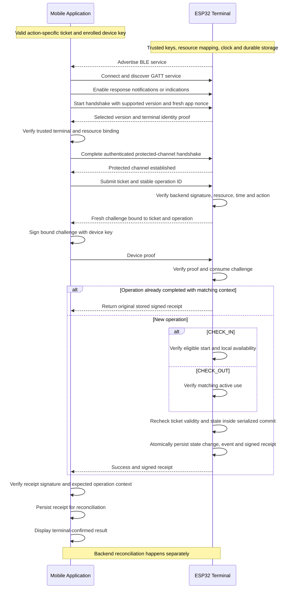
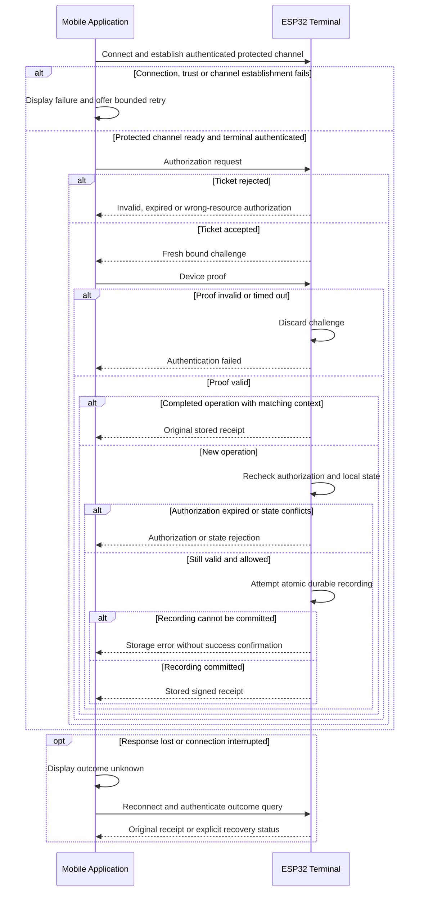
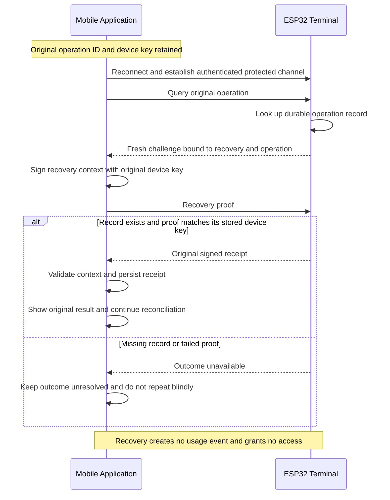

# BLE Communication Flow

Status: Sprint 1 design proposal for issue #3 (T-003), ready for team review. This document defines the communication contract at a conceptual level; it does not specify a final wire format or cryptographic implementation. Requirements and existing team proposals are distinguished from the additional BLE design decisions proposed here.

## Purpose and scope

Define how the mobile application and resource terminal establish BLE communication, verify authorization and device possession, and record check-in and check-out. Included are actors, messages, successful flows, rejection outcomes, initial recovery, security considerations, and offline assumptions. Mobile classes, firmware, final formats, final cryptographic algorithms, detailed synchronization, and performance optimization are excluded.

## Actors and prerequisites

| Actor | Responsibility |
|---|---|
| Mobile application | Discover the terminal, establish BLE communication, submit an authorization ticket, prove possession of the device key, retain receipts, and display the result. |
| ESP32 resource terminal | Advertise the BLE service, validate tickets and device proofs offline, enforce local state transitions, durably record events, and return signed receipts. |
| Backend (outside the BLE sequence) | Bind an enrolled device to a user, issue authorization tickets, and reconcile signed events. |

The terminal is the BLE peripheral and GATT server; the mobile application is the central and GATT client. Advertising identifiers are discovery hints, not proof of identity.

Before the exchange, the application has a backend-signed ticket bound to its device public key, booking, resource, action, and bounded validity interval. Enrollment and ticket acquisition happen outside this diagram. The private device key stays in platform-protected storage. The terminal is provisioned with its resource and terminal identifiers, trusted backend verification key, protected signing key, and a sufficiently trustworthy clock. The application needs a trusted way to validate terminal identity and receipts; its provisioning mechanism remains a team decision.

User identification is indirect: the backend associates the user with the booking and enrolled device. The terminal verifies that authorization and possession of the corresponding device key; it need not receive a user's name or email.

### Backend prerequisites and application integration

The existing backend proposal issues a CHECK_IN ticket while the booking is BOOKED and a CHECK_OUT ticket only after the booking becomes CHECKED_IN. Therefore a locally confirmed check-in must be reconciled with the backend before the app can obtain a check-out ticket. BLE success and backend confirmation are separate application states.

| Application state | Behavior |
|---|---|
| Check-in recorded at terminal, upload pending | Display check-in confirmed at terminal and synchronization pending. Retain the receipt. Do not perform another check-in. |
| User requests check-out with a pending check-in receipt | Recover a missing receipt if needed, upload the check-in receipt, and wait for backend acceptance before requesting a CHECK_OUT ticket. |
| Check-in upload temporarily fails | Retry when connectivity returns. Under the current backend proposal, no new check-out ticket can be obtained meanwhile. Explain this limitation to the user. |
| Backend rejects the receipt or reports a state conflict | Keep the evidence and surface the conflict for review. Do not claim central confirmation or silently undo a terminal event. |
| Backend confirms check-in | Obtain a fresh CHECK_OUT ticket and execute the check-out BLE flow. |
| Check-out recorded at terminal, upload pending | Retain and upload its receipt later. Do not repeat the check-out action. |

Fully offline check-out on a phone that has no CHECK_OUT ticket is not supported by this baseline. Providing such a fallback requires a separate, agreed authorization policy, not reuse of a CHECK_IN ticket. Inability to record an app check-out must not be interpreted as a rule preventing a person from leaving a resource; physical exit behavior is outside this communication design.

The mobile integration must provide conceptual operations for ticket acquisition, BLE execution, receipt persistence/upload, and result recovery. Thomas's mobile architecture leaves the BLE contract open. The concrete mapping into its interfaces remains a joint integration decision; this spike does not add BLE-specific mobile classes or redefine REST endpoints.

## Successful check-in and check-out

Check-in requires a CHECK_IN ticket and creates a start-of-use event. Check-out requires a new CHECK_OUT ticket and creates an end-of-use event for the matching active use. A terminal receipt confirms local recording, not backend reconciliation. Any physical access signal is issued only after successful durable recording; physical actuator behavior is outside this spike.

The design assumes the same terminal handles both actions. Multiple terminals for one resource require an agreed coordination mechanism before this assumption can be relaxed.

### Local state transitions

| Action | Required local state | Successful local outcome |
|---|---|---|
| CHECK_IN | A valid start authorization and no conflicting active use | Record active use for the booking and create one check-in event. |
| CHECK_OUT | Matching booking is actively in use | End that use and create one check-out event. |
| Repeat of a committed operation | Same recorded operation and authenticated device/context | Return its existing receipt without changing state or creating an event. |

The terminal serializes state-changing requests and rechecks ticket validity, duplicate records, and local state before committing. Its locally known active-use state does not prove that no future reservation exists. The backend remains responsible for central availability and booking eligibility when issuing the ticket; later changes are subject to the bounded offline window.

### Protected-channel prerequisite

Terminal authentication and channel protection are required before ticket submission. The proof must demonstrate current possession of the trusted terminal key and bind the expected terminal/resource, fresh app nonce, selected version, and handshake context. A static terminal identifier or certificate alone is insufficient to prove that the connected peer possesses the key.

The chosen handshake must establish confidentiality and integrity, reject tampering or downgrade, and bind subsequent device proofs to the resulting session. If terminal trust, resource binding, or channel establishment fails, abort without sending the ticket. This is a required protocol property and proposed sequence; choosing authenticated BLE pairing, an application-layer secure channel, or both is left to implementation review. No custom cryptographic algorithm is specified here.

## Conceptual message contract

Names below describe message purposes, not final serialized message names or fields.

| Message | Direction | Purpose |
|---|---|---|
| Protocol / channel handshake | Both | Select and authenticate a supported version, verify terminal trust and establish confidentiality and integrity before ticket submission. |
| Terminal identity proof | Terminal to app | Prove possession of a trusted terminal key with fresh context bound to the resource and session. |
| Authorization request | App to terminal | Carry the signed ticket and stable operation identifier. |
| Challenge | Terminal to app | Fresh nonce associated with this session, ticket, operation, resource, terminal, and action. |
| Device proof | App to terminal | Prove possession of the device private key over the bound challenge context. |
| Result / signed receipt | Terminal to app | Confirm a durably recorded event or return the original result of an authenticated duplicate. |
| Error result | Terminal to app | Describe a rejected or failed request without exposing secrets. |
| Outcome query | App to terminal | Identify the original operation for a read-only recovery attempt. |
| Recovery challenge / proof | Both | Prove possession of the original device key with a fresh challenge bound to recovery, operation and session. |
| Recovery result | Terminal to app | Return the original signed receipt after successful proof, or a generic unavailable result. Never create or modify a usage event. |

Identifiers include protocol version, operation ID, ticket ID, booking ID, resource ID, terminal ID, and event/receipt ID. Operation IDs remain stable across retries. Reuse of an operation ID with different context is rejected. The terminal also checks booking/action state and ticket use so a new operation ID cannot bypass duplicate protection.

The app persists the operation ID and intended action before submitting a request. Committed terminal records retain the operation ID, booking, resource, action, original device verification key or an equivalent durable binding, and signed receipt. A receipt must bind the event to these identifiers and the terminal identity. The app checks both the trusted signature and the expected context, not merely that some terminal signed it. These are logical bindings; final field names and serialization remain out of scope.

Large tickets may need application-level reassembly across multiple BLE writes. Exact characteristics, UUIDs, framing, size limits, and MTU behavior are implementation decisions. Incomplete or oversized messages must not produce usage events.

## Rejection and recovery flow

| Situation | Outcome and initial handling |
|---|---|
| No terminal, unavailable Bluetooth, or connection failure | Explain the local issue and allow a bounded retry. |
| Unsupported protocol or untrusted terminal | Abort before transmitting sensitive authorization data. |
| Invalid signature, wrong resource/action, unknown authorization | Reject; create no usage event. |
| Expired ticket | Reject; acquire a replacement through the backend when possible. |
| Untrustworthy terminal clock | Reject time-dependent authorization until trustworthy time is restored. |
| Invalid or late device proof | Discard the challenge; any new attempt uses a new challenge. |
| Active-use conflict or check-out without matching check-in | Reject and display a state conflict. |
| Identical authenticated duplicate | Return the original receipt without a second event. |
| Durable commit failure | Do not signal success or grant physical access. |
| Connection loss or ambiguous storage outcome | Show outcome unknown and recover the stored result; never assume failure and blindly repeat the action. |
| Receipt validation fails | Do not display confirmed success; retain diagnostics without secrets and recover through a trusted channel. |
| Receipt upload fails | Retain the receipt and retry reconciliation later without repeating the BLE action. |
| Check-in upload pending when check-out is requested | Reconcile check-in first. If it cannot be reconciled, explain that the baseline cannot obtain a CHECK_OUT ticket. |

### Read-only recovery after a lost result

Outcome recovery is a separate operation from check-in/check-out. For a committed operation, the terminal authenticates the requester against the original device key retained with the event. An expired action ticket is therefore not needed to read that original receipt, and recovery never authorizes a new action.

Use the same generic unavailable outcome for a missing record or a failed proof, avoid exposing receipt details before authentication, and bound attempts. The original device proof must bind a fresh nonce, recovery purpose, operation ID, terminal identity, and protected session. Device-key loss requires a separate authorized recovery path; another device is not automatically entitled to this receipt.

Ticket expiry and loss of action eligibility do not erase a committed event. Read-only receipt retrieval is allowed under this proposed policy only during the agreed recovery retention window and while the terminal remains trusted and in service. This does not bypass any new-action revocation rule. Retention duration and handling of centrally revoked or lost devices require an explicit team policy before deployment.

An unavailable result is not proof that no commit occurred. The app retains the original operation ID, blocks blind repetition, and uses backend reconciliation or administrator assistance. A new attempt is permitted only after an authoritative check establishes that the action was not committed, and requires valid current authorization. An identical retry with a still-valid ticket may return the original receipt as shown in the success flow. Recovery across reboot depends on the durable operation record.

## Initial security considerations

- Backend signatures establish authorization; device proofs establish possession of the ticket-bound private key. BLE address, proximity, and advertising alone never grant access.
- Each challenge is unpredictable, short-lived, consumed once, and bound to the ticket, action, operation, terminal, resource, and session. A signature over an unbound random number is insufficient as a complete protocol contract.
- Fresh challenges prevent reuse of old proofs. Persistent operation/ticket records and state checks separately prevent repeated valid requests from producing duplicate events.
- Authenticate terminal identity and establish confidentiality and integrity before any ticket or recovery data is submitted. The handshake binds fresh context and protocol version to the selected terminal/resource. Whether authenticated BLE pairing, an application-layer protected channel, or both are used remains open. Ticket signatures alone do not provide confidentiality.
- Protect private keys at the device and terminal. Validate both trusted receipt signatures and the expected booking, action, resource, terminal and operation context. Never treat a replayed receipt for a different operation as the current result.
- Minimize personal information and exclude tickets, private keys, and sensitive proofs from logs. Apply message limits, timeouts, and bounded retries to limit misuse.
- BLE cryptographic authentication does not prove physical distance. Relay attacks remain a documented limitation requiring team acceptance or additional mitigation.

## Offline policy and persistence

The terminal validates access without Wi-Fi or a backend request using provisioned trust and the signed ticket received over BLE. Missing, unknown, or expired authorization is rejected. The backend concept currently assumes the phone is online to obtain short-lived tickets; this is distinct from an offline terminal.

This rejection rule applies to new usage actions. Reading an already committed receipt uses the separate recovery proof and changes no access or usage state. Backend-dependent ticket issuance, including the check-in upload prerequisite for check-out, limits what the phone can do offline.

The backend proposal suggests five-minute ticket validity. This document treats that as a candidate value, not an agreed policy. The team must define the maximum validity, clock tolerance, and maximum delay before user/device/booking revocation takes effect offline. Cancellation after ticket issuance may remain invisible to the terminal until ticket expiry; backend rejection later cannot undo physical access already granted.

The terminal durably retains events and receipts until acknowledged reconciliation under the agreed retention policy. The phone also retains receipts pending backend upload. Synchronization must deduplicate by stable event identity and flag conflicts for administrator review rather than silently overwrite them. Ordering must preserve check-in/check-out relationships.

The backend proposal uses the phone as a messenger and describes no regular terminal/backend connection. FR-05.04 requires durable terminal queuing and synchronization on reconnection. The team must agree whether reconciliation uses a phone relay or another reconnection path and how acknowledgment reaches the terminal. Detailed synchronization implementation is outside this spike.

## Design decisions and open assumptions

| Decision / assumption | Rationale or unresolved point |
|---|---|
| Two primary BLE actors | Backend enrollment, ticket issuance, and reconciliation remain outside the BLE diagram. |
| Ticket–challenge–receipt baseline | Aligns with the existing backend proposal; remains subject to team review. |
| Action-specific tickets | Check-in permission must not implicitly authorize check-out. |
| Atomic persistence before success | Prevents a success response without a recoverable event record. |
| Stable operation identity and authenticated recovery | Resolves lost responses without duplicate usage events. |
| Read-only recovery uses the event's original device key | Allows retrieval after action-ticket expiry without extending action authorization. |
| Check-in reconciliation precedes CHECK_OUT ticket acquisition | Matches the backend proposal's BOOKED / CHECKED_IN ticket rules. |
| Same-terminal local state | Multi-terminal resource coordination remains unresolved. |
| Bounded offline authorization | Requires agreed validity, clock policy, and revocation delay. |
| Protected channel before ticket submission | Sequence and required security properties are specified. Trust enrollment and concrete handshake mechanisms need implementation review. |
| Concurrent use requests | Terminal serializes local decisions; coordination with backend/web changes requires an explicit conflict policy. |

### Team decisions before implementation

| Decision | Proposed coordination |
|---|---|
| Terminal trust enrollment and secure-channel mechanism | Mobile and terminal contributors agree how the app obtains a trusted terminal identity and establishes the channel. |
| Offline validity, clock error, revocation delay and key rotation | Backend and terminal contributors define numerical limits and failure policy. Five-minute ticket validity remains a candidate. |
| Receipt acknowledgment and durable queue reconciliation | Backend, mobile and terminal contributors agree the relay/reconnection path, conflict handling and authenticated acknowledgment. |
| Recovery retention and device revocation | Agree the read-only receipt policy and recovery path for a lost device/key. |
| Check-out without phone connectivity or pending check-in reconciliation | Decide whether the baseline limitation is acceptable or requires an alternative authorization design. |
| Multiple terminals and concurrent central changes | Agree resource coordination before relaxing the same-terminal assumption. |

## Requirement coverage

| Requirement | Coverage |
|---|---|
| FR-05.01 | Ticket binds booking/resource/device; backend enrollment provides user linkage. |
| FR-05.02 | Separate check-in/check-out events and valid local state transitions; central status changes after reconciliation. |
| FR-05.03 | Offline signature and validity checks; fail closed for unknown/expired authorization. |
| FR-05.04 | Durable queue, stable event identities, deduplication and conflict escalation; reconciliation path remains open. |
| FR-05.05 | Actors, enrollment prerequisites, conceptual messages, versions, identifiers, outcomes, errors, and handshake; synchronization boundary documented. |
| NFR-01.03 | Device authentication, bound proofs, replay controls, protected-channel setup, terminal trust and receipt-context validation; final mechanism remains open. |
| NFR-01.04 | Bounded validity and revocation limitations documented; numerical policy requires team agreement. |

## Design walkthrough

The following cases were checked against the proposed sequences. This is a documentation consistency review, not an implementation test or security certification.

| Case | Expected result |
|---|---|
| Valid CHECK_IN and available local state | One durable check-in event and a matching receipt. |
| Valid CHECK_OUT after backend-confirmed check-in | One durable check-out event for the active booking. |
| Expired, forged or wrong-resource ticket | No new usage event. |
| Copied ticket without the original device key | Fresh device proof fails. |
| Untrusted terminal or failed protected-channel setup | No ticket submission. |
| Concurrent or repeated requests | Serialized validation and duplicate checks prevent another event for an already applied action. |
| Receipt response lost, then ticket expires | Original device can recover the existing receipt through read-only proof while its record is retained. |
| Recovery record missing or key proof fails | Generic unavailable result and no new action. |
| Storage failure or authorization expiry before commit | No successful commit or access confirmation. |
| Pending check-in upload at check-out | Reconcile first or report that CHECK_OUT ticket acquisition is blocked under the baseline. |

These outcomes cover the issue's expected actors, connection/identification, check-in/check-out, message exchanges, success/failure, initial error handling, security considerations, and documented assumptions. Team decisions above remain explicit rather than being presented as agreed implementation details.

## References

- [Issue #3: T-003 Define BLE communication flow](https://github.com/thomas-sartini/ble-booking-system/issues/3)
- [Sprint 1](https://github.com/thomas-sartini/ble-booking-system/milestone/1)
- [Requirements baseline](https://github.com/thomas-sartini/ble-booking-system/blob/8daa17c7d385a88aa5723a78f0b911ac6bf31ca4/planning/requirements.md)
- [Backend signed-ticket proposal](https://github.com/thomas-sartini/ble-booking-system/blob/33d27decd026d4631dfa22d6f69fe00728a251f0/backend/docs/check-in-concept.md)
- [Mobile architecture proposal](https://github.com/thomas-sartini/ble-booking-system/blob/d8e3c2cb88411f20e8427e544db0c49e25b55eb3/docs/report/assets/mobile-arc.md)

This document proposes a communication design and identifies integration decisions. It does not claim that the protocol is implemented or that unresolved security mechanisms have been validated.
