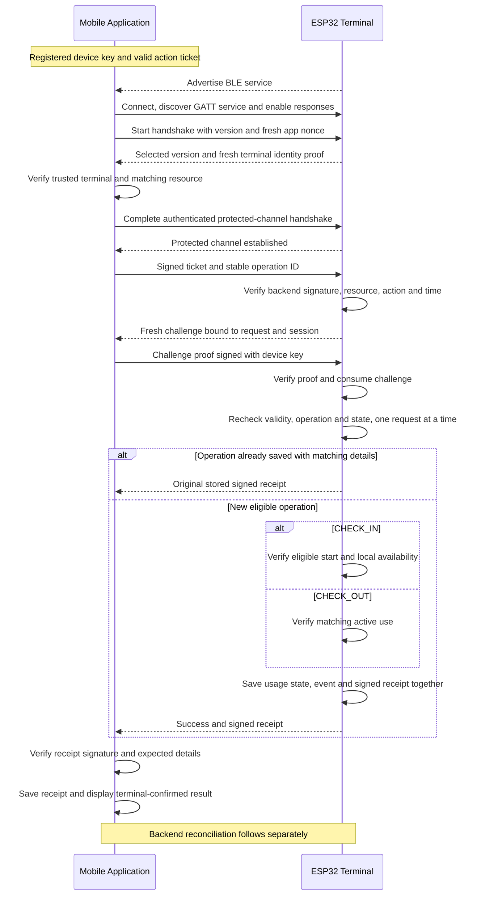
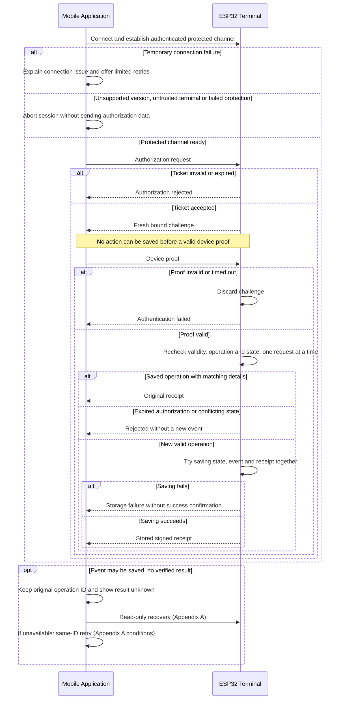
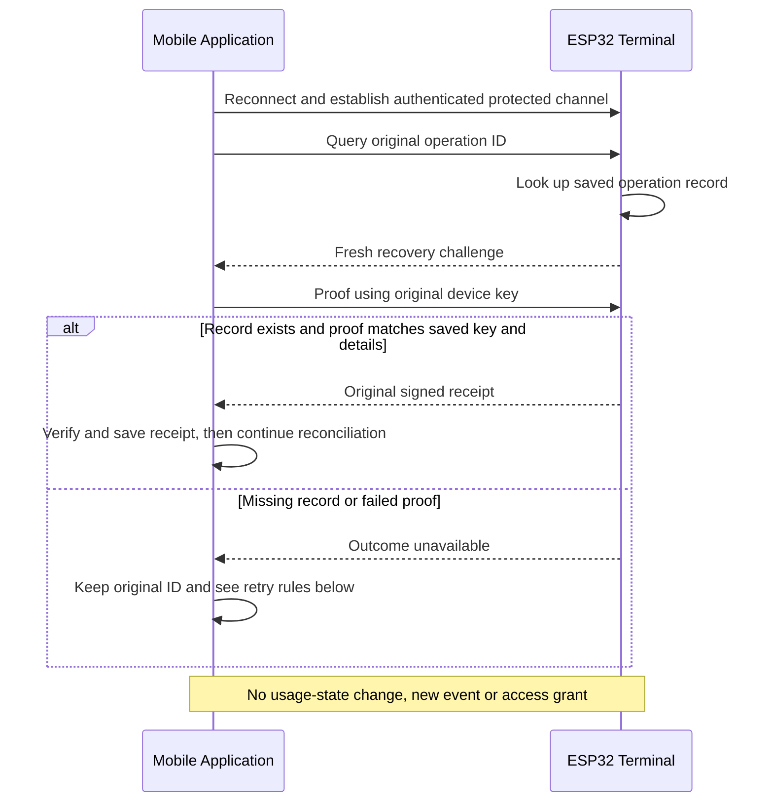

# BLE Communication Flow

Status: Sprint 1 design proposal for [issue #3 (T-003)](https://github.com/thomas-sartini/ble-booking-system/issues/3), ready for team review.

## 1. Purpose and scope

This document proposes how the mobile app and resource terminal communicate over BLE to identify an authorized device and record check-in and check-out. It builds on the backend's signed-ticket proposal.

### The idea in short

Before check-in, the app gets a signed ticket from the backend. The terminal can check this ticket without an internet connection. The app also answers a fresh challenge to prove that it holds the private key of the device named in the ticket, so copying the ticket to another phone is not enough. After accepting the action, the terminal saves the event and returns a signed receipt, which the app uploads to the backend. Check-out follows the same steps with a separate ticket. Terminal trust, offline limits, synchronization, and the other questions in section 7 still need team agreement.

The spike covers the actors, BLE connection, identification, check-in/check-out, messages, success and failure cases, initial security rules, and design decisions. It does not cover BLE implementation, mobile classes, terminal firmware implementation, final message formats, final cryptographic choices, detailed synchronization implementation, or performance optimization.

## 2. Actors and prerequisites

| Actor | Responsibility |
|---|---|
| Mobile application | BLE central / GATT client. Find and verify the terminal, send a ticket, prove possession of the device key, and save and upload receipts. |
| ESP32 resource terminal | BLE peripheral / GATT server. Check authorization offline, track local resource use, save events so they survive a restart, and return signed receipts. |
| Backend | Register devices and link them to users, issue tickets, and check uploaded events. It takes no part in the BLE exchange. |

Before an action:

- The device has a registered key pair. Its private key stays in platform-protected storage; the backend links its public key to the user.
- The app has a backend-signed ticket for this device key, booking, resource, action, and time window.
- The terminal knows its terminal/resource IDs and the trusted backend verification key. It also needs a protected signing key, a reliable clock, and storage that survives a restart.
- The app has trusted information to verify the terminal. How it receives that information is still open.

The backend links the user to the booking and device. The terminal checks that permission and the device's proof of key possession. It does not need a name or email. BLE advertising and addresses help find the terminal; they do not prove identity.

**Backend dependency:** the current proposal issues `CHECK_IN` tickets for `BOOKED` bookings and `CHECK_OUT` tickets only for `CHECKED_IN` bookings. After a local check-in, the app must upload the receipt and wait for backend acceptance before it can get a check-out ticket. If the upload fails, the app keeps the receipt and shows synchronization pending. A check-in ticket cannot be used for check-out. A phone without connectivity needs a suitable ticket already available or a different agreed policy. Physical exit behavior is outside this design.

Mobile integration must connect ticket requests, native BLE, receipt storage/upload, and recovery of missing results. This spike adds no mobile classes or REST endpoints.

## 3. Successful connection, identification, check-in, and check-out

Both actions use the same BLE exchange, but each needs its own ticket.

| Action | Required local state | Successful outcome |
|---|---|---|
| `CHECK_IN` | The authorized booking may start. There is no conflicting use and this booking has not already been started. | Save one start event and mark the booking in use. Signal access only after saving succeeds. |
| `CHECK_OUT` | The same booking is currently in use. | Save one end event and end that use. |
| Authenticated duplicate | The operation, device, and request details match the saved record. | Return the original receipt without another event or access action. |

The terminal processes requests one at a time. It saves the usage state, event, and receipt together, so a restart cannot leave only part of the update saved. Its records must also prevent duplicate actions after a restart. A different operation ID or replacement ticket must not allow the same booking action twice.

If a reset or storage loss makes the terminal's saved state unreliable, it blocks all new actions until that state is restored. Normal expiry of one recovery record does not block unrelated actions if the remaining usage and replay-protection records are reliable; section 5 explains that case.

The backend checks booking eligibility when issuing a ticket. A terminal showing a resource as free does not prove it is free in the backend. This proposal assumes the same terminal handles check-in and check-out.

## 4. Conceptual communication contract

The table describes what the messages do and which details they must link together. It does not define their final names or format.

| Message | Direction | Meaning |
|---|---|---|
| Handshake / terminal proof | Both | Choose a supported version, verify the terminal and resource using fresh handshake data, and set up a connection that prevents reading or changing messages in transit. |
| Authorization request | App → terminal | Send the signed action ticket and the operation ID, which stays the same on retries. |
| Challenge / device proof | Both | Send a fresh challenge that can be used once and answer it with the ticket's device key. The proof covers the ticket, operation, action, terminal, resource, and protected session. |
| Success / signed receipt | Terminal → app | Confirm a saved event, with its event ID and the details of the operation. |
| Error result | Terminal → app | Explain a rejection or failure without exposing sensitive details. An unknown result is different from a confirmed rejection. |
| Outcome query / recovery proof | Both | Ask for the original result using the original device key and a fresh proof. This only reads a saved record. See Appendix A. |
| Recovery result | Terminal → app | Return the original signed receipt or a generic outcome unavailable response. Do not create a new event. |
| Reconciliation acknowledgment (proposed) | App → terminal | Relay the backend's signed result for a saved event and terminal. After checking the signature, the terminal marks only accepted or already accepted events as reconciled. Keep evidence of conflicts/rejections for review. |

The exchange uses a protocol version and IDs for the operation, ticket, booking, resource, terminal, and event/receipt. The app saves the operation ID and intended action before sending the request. It keeps that ID when retrying. The same ID cannot be used with a different booking, resource, action, terminal, or device key. A permitted replacement ticket keeps these details and the operation ID, although its ticket ID and validity period may change (section 7).

The terminal saves the original device key and request details with the completed operation. A duplicate returns the original receipt with the original ticket ID and event time. The app keeps the original request details and checks both the trusted signature and that the receipt matches that operation. A replacement ticket must not cause it to reject a matching original receipt just because the ticket ID differs.

GATT characteristics, UUIDs, message framing, packet sizes, and cryptographic formats are left for implementation. Incomplete, malformed, or oversized messages must not create usage events.

### Reconciliation boundary

Reconciliation means checking the terminal's events and updating the central backend state. The phone carries the signed receipts. The acknowledgment below is an additional proposal for FR-05.04/05.05:

1. The terminal and app keep events/receipts until reconciliation. When connected, the app uploads the original receipt over an authenticated, encrypted connection.
2. The backend checks terminal trust, signature, event details, and the order of check-in/check-out. It uses the event/receipt ID to process each event once, without duplicate usage records or charges.
3. The backend signs its result: accepted, already accepted, or conflict/rejection. The result identifies the event and terminal. The app carries it back; the terminal checks the backend signature itself. Signing format and how trusted keys are installed remain open.
4. Only accepted or already accepted marks an event as reconciled. Keep conflicting events for Admin review. A rejected upload does not delete the terminal event or undo access already granted.

If no phone or other relay is available, events stay queued. The team must decide who brings back check-out acknowledgments after the phone has left. If the queue is full, reject new actions that cannot be saved; never delete pending evidence to make room. Queue capacity, acknowledgment format, retry timing, retention periods, and other relay paths are still open. This defines responsibilities, not the detailed synchronization implementation.

## 5. Failure and initial recovery

| Situation | Initial handling |
|---|---|
| Bluetooth unavailable, no terminal, or temporary connection failure before an action | Explain the problem and allow a limited number of retries when the connection can be restored. |
| Unsupported version, untrusted terminal, or failed channel protection | Stop before sending the ticket or other authorization data. Resolve the problem first; do not retry automatically or switch to an unprotected connection. |
| Invalid/unknown ticket, wrong resource/action, or unreliable clock | Reject the new action without an event. |
| Expired ticket or late/invalid device proof | Reject. Request a valid replacement ticket if needed and always use a fresh challenge for a new proof. |
| Conflicting use, mismatched request details, or check-out without active use | Reject without overwriting the saved state. |
| Storage failure or full event queue | Do not confirm success or signal access. If saving may have succeeded, recover the result. |
| Connection lost before this attempt could save an event | Report this attempt as unsuccessful. Keep any earlier unknown result unresolved. |
| Missing response or invalid receipt after an event may have been saved | Keep the original operation ID and follow the recovery steps below. |
| Saved terminal history lost or unreliable | Block all new actions until the terminal's state is restored (section 3). |
| Operation record outside the retention period | Only this operation stays unresolved. A missing record does not prove it never happened. Resolve it through reconciliation or Admin assistance before retrying. Unrelated actions may continue if usage and replay-protection records are reliable. |
| Receipt upload fails, or check-in upload is still pending at check-out | Keep and retry the upload. Getting a check-out ticket waits for accepted check-in reconciliation. |
| Backend conflict/rejection | Keep the evidence, show synchronization pending/conflicted, and flag it for Admin review. |

**Unknown result:** the terminal can save an action only after checking the device proof. If the attempt stops before the app starts sending that proof, this attempt is unsuccessful. After sending starts, its result stays unknown until a verified receipt or an authenticated final rejection arrives. Rejecting a retry before checking saved history does not resolve a previous attempt.

**Initial recovery:** keep the original operation ID and request details, reconnect securely, and ask for the saved receipt. This read-only query cannot perform check-in or check-out. An unavailable result does not prove that no event exists. Do not create a new operation ID to bypass the uncertainty. If the result cannot be resolved, retain the evidence for reconciliation or Admin assistance.

A terminal receipt confirms the local event; backend acceptance separately confirms the central update. Appendix A proposes the detailed recovery and limited retry rules for later implementation. Those rules need team agreement before an unknown action can be retried.

## 6. Security and offline policy

- **Terminal trust and protected connection:** before sending a ticket, verify fresh proof that the terminal holds its trusted private key. The proof must cover the expected terminal/resource, a fresh app nonce (random value), protocol version, and handshake/session. A static ID or certificate alone is not enough. The connection must prevent disclosure, tampering, and a forced switch to weaker protection. Whether to use authenticated BLE pairing, an application-layer protected connection, or both is still open.
- **Authorization and replay:** the backend signature grants permission for a limited time; the device proof shows key possession. Challenges must be unpredictable, short-lived, usable once, and linked to the request/session. Saved operation/ticket and booking records prevent duplicate actions even with a valid new proof.
- **Keys, receipts, and data:** protect private keys, check receipt signatures and request details, and avoid unnecessary personal data or secrets in logs. Limit message size, waiting time, and retries. BLE authentication does not prove physical distance; forwarding the signal from far away (a relay attack) remains a known limit to address or accept.
- **Offline boundary:** the terminal checks tickets and saves actions without Wi-Fi or backend access. The phone still needs connectivity to get new tickets under the backend proposal. Reject unknown/expired permission or an unreliable clock for new actions. Read-only recovery has separate rules.
- **Validity and revocation:** five-minute ticket validity is a backend proposal, not an agreed limit. The team must set maximum validity, allowed clock error, key rotation, and how long an offline terminal may remain unaware of a blocked device or cancelled booking. A ticket issued earlier may still work until expiry. Later backend rejection cannot undo access already granted.
- **Storage:** keep pending events and receipts across restarts, preserve action order, and agree how long replay-protection and recovery records stay available. Multiple terminals and concurrent booking changes need a coordination policy.

## 7. Decisions and assumptions to confirm

The proposed flow uses a ticket, a device challenge/proof, and a saved event with a signed receipt. It also needs a protected BLE connection, separate backend reconciliation, and read-only recovery. We assume one terminal manages local resource use and ESP32 is the terminal hardware. Both assumptions need team confirmation.

### Proposed design decisions and reasons

| Decision | Reason |
|---|---|
| Action-specific tickets | A check-in ticket must not allow check-out. This follows the backend's booking-status rules. |
| Save state, event, and receipt together before success | Keep all three consistent after a restart. Confirm success or signal access only once they are safely saved. |
| Keep the operation ID on retries | Retrying the same action must not create duplicate events or access actions. Keep the same request details with retries and permitted replacement tickets. |
| Recover with the original device key | Retrieve the old receipt after ticket expiry without allowing a new action or giving it to another device. Lost or revoked keys need separate rules. |
| Protect the connection before sending a ticket | Verify the expected terminal and protect tickets and proofs from being read or changed. The exact mechanism is open. |
| Same terminal for check-in and check-out | An offline terminal can check the order using its own saved state. Several terminals need coordination first. |

### Open team decisions

| Decision | Contributors / required agreement |
|---|---|
| Terminal trust and connection protection | Mobile and terminal: how the app gets trusted terminal information, which handshake is supported, and which protocol versions are allowed. |
| Offline authorization policy | Backend and terminal: maximum ticket validity, clock error, revocation delay, key rotation, and what happens if reliable time is lost. |
| Reliable reconciliation | Backend, mobile, and terminal: signed acknowledgments and trusted keys, who carries check-out acknowledgments, queue capacity and recovery when full, retention, and conflicts. |
| Recovery policy | Backend, mobile, and terminal: original device-key mapping, retention period, lost/revoked devices and keys, and restoring terminal state after a reset or storage loss. |
| Replacement tickets for unresolved operations | Backend, mobile, and terminal: confirm when a replacement can be issued before the original receipt is uploaded. Booking, time, and device must still be eligible. Agree unchanged request details, history retention, and handling of booking changes. Replacement is not guaranteed after NO_SHOW, COMPLETED, cancellation, or device revocation. |
| Late receipts and backend time rules | Backend: the proposal sets NO_SHOW 15 minutes after start and COMPLETED at booking end. New check-in receipts require BOOKED; new check-out receipts require CHECKED_IN. Decide whether a reliable terminal timestamp showing an earlier event can correct an automatic status change, including conflicts and billing, or whether Admin review is needed. A valid signature does not prove the clock was correct. |
| Check-out without phone connectivity or with check-in upload pending | Backend, mobile, and terminal: accept this limitation or agree another authorization flow. |
| Resource coordination | Backend and terminal: coordinate several terminals and simultaneous central booking changes. Local state must not override central booking eligibility. |
| Walk-in access without prior booking (FR-03.05) | Backend and mobile: propose creating an immediate booking after checking user eligibility, availability, and other reservations. Confirm the duration and ticket issuance. If supported, the BLE exchange stays the same. This is not yet agreed. |
| Data-model alignment | Backend and database: agree how registered devices link to users, where public verification keys are stored, and how stable operation/event/receipt IDs map to AccessEvent or receipts to prevent duplicates. These device/key and receipt mappings are not yet described in the database proposal. |

## 8. Requirement coverage

| Requirement | Design coverage / remaining decision |
|---|---|
| FR-03.05 (integration dependency) | Proposed immediate booking could reuse the existing BLE flow. Eligibility, availability, duration, and ticket issuance still need backend/mobile agreement. Walk-in is not finalized. |
| FR-05.01 | Link the user through device registration and a ticket for the booking, resource, and device. |
| FR-05.02 | Separate start/end events and valid local state changes; update central status after reconciliation. |
| FR-05.03 | Check permission offline and save events across restarts. Reject unknown/expired permission. |
| FR-05.04 | Keep pending events, define relay and acknowledgment responsibilities, prevent duplicates, preserve order, and use Admin conflict review. Transport details remain open. |
| FR-05.05 | Define enrollment (device registration) prerequisites, actors, versions, IDs, messages, outcomes, errors, handshake, and the synchronization boundary. |
| NFR-01.03 | Verify device/terminal identity, protect messages, link proofs to requests, check receipts, and prevent duplicate/replayed actions. The concrete mechanisms still need review. |
| NFR-01.04 | Limit offline permission and explain revocation delays. The numerical limits are still open. |

## Appendix A. Additional recovery proposal

This appendix details the read-only recovery used in section 5 and adds a proposal for limited retries. Retention, revocation, and replacement-ticket policies still need team agreement (section 7).

### Read-only outcome recovery

Recovery asks for a saved receipt using the original device key linked to the event. It can work after the action ticket expires. It does not extend permission, create an event, or grant access.

The recovery proof must cover a fresh nonce, its recovery purpose, operation ID, terminal identity, and protected session. Check the device proof before showing receipt details. Return the same generic unavailable result if the record is missing or the proof fails, and limit attempts.

Recovery is allowed only under the retention and revocation rules agreed by the team. Losing the device key needs another authorized recovery path; a different device does not automatically get the receipt. Keep events awaiting reconciliation even after their tickets expire.

### Final rejection and limited execution retries

A rejection resolves the whole operation only after the terminal has checked its complete, reliable history within the retention period, one request at a time. It must confirm that the operation was not saved and that no earlier attempt can still succeed. A rejection before that check, such as an invalid ticket or failed proof, says nothing about a previous attempt. Failure to reconnect also leaves a previous unknown result unresolved.

If recovery is unavailable **within the agreed retention period**, the app may retry the original action a limited number of times under the agreed policy. Use the **same operation ID**, a valid ticket, and a fresh device proof at the original terminal. Any replacement ticket must keep the details listed in section 4 and meet current backend eligibility and the policy in section 7. The terminal needs reliable saved history and must check requests one at a time. It returns the original receipt if already completed, or saves the action once if still allowed and not already applied.

If these conditions are not met or no confirmed result is available, keep the result unresolved and retain the original details for reconciliation or Admin assistance. An operation outside the retention period must be resolved before execution is retried. Never create a new operation ID to bypass uncertainty. Execution retries are separate authorization exchanges; read-only recovery follows its own policy and does not need a new action ticket.

## References

- [Issue #3 and its expected outcomes](https://github.com/thomas-sartini/ble-booking-system/issues/3)
- [Requirements baseline](https://github.com/thomas-sartini/ble-booking-system/blob/8daa17c7d385a88aa5723a78f0b911ac6bf31ca4/planning/requirements.md)
- [Backend signed-ticket proposal](https://github.com/thomas-sartini/ble-booking-system/blob/33d27decd026d4631dfa22d6f69fe00728a251f0/backend/docs/check-in-concept.md)
- [Mobile architecture proposal](https://github.com/thomas-sartini/ble-booking-system/blob/d8e3c2cb88411f20e8427e544db0c49e25b55eb3/docs/report/assets/mobile-arc.md)
- [Database schema proposal](https://github.com/thomas-sartini/ble-booking-system/blob/37118573105214dd493901a597c8171d8532d6bd/docs/report/assets/database-concept.md)
