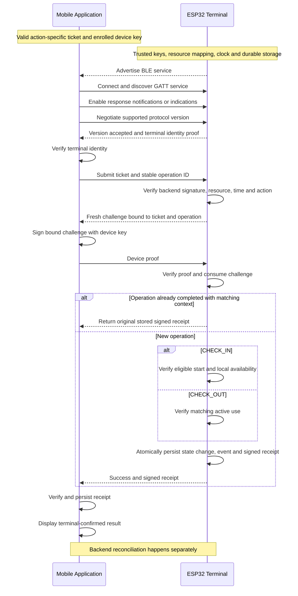
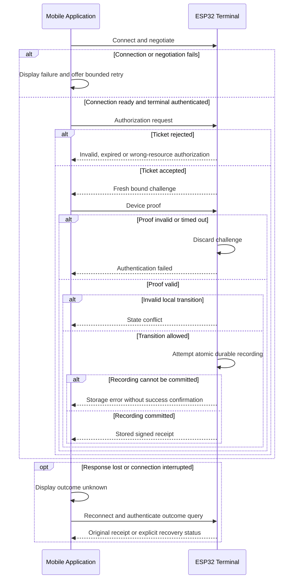

# BLE Communication Flow

Status: Sprint 1 design proposal for issue #3 (T-003). This document defines the communication contract at a conceptual level; it does not specify a final wire format or cryptographic implementation.

## Purpose and scope

Define how the mobile application and resource terminal establish BLE communication, verify authorization and device possession, and record check-in and check-out. Included are actors, messages, successful flows, rejection outcomes, initial recovery, security considerations, and offline assumptions. Mobile classes, firmware, final formats, final cryptographic algorithms, detailed synchronization, and performance optimization are excluded.

## Actors and prerequisites

| Actor | Responsibility |
|---|---|
| Mobile application | Discover the terminal, establish BLE communication, submit an authorization ticket, prove possession of the device key, retain receipts, and display the result. |
| ESP32 resource terminal | Advertise the BLE service, validate tickets and device proofs offline, enforce local state transitions, durably record events, and return signed receipts. |
| Backend (outside the BLE sequence) | Bind an enrolled device to a user, issue authorization tickets, and reconcile signed events. |

The terminal is the BLE peripheral and GATT server; the mobile application is the central and GATT client. Advertising identifiers are discovery hints, not proof of identity.

Before the exchange, the application has a backend-signed ticket bound to its device public key, booking, resource, action, and bounded validity interval. Enrollment and ticket acquisition happen outside this diagram. The private device key stays in platform-protected storage. The terminal is provisioned with its resource and terminal identifiers, trusted backend verification key, protected signing key, and a sufficiently trustworthy clock. The application needs a trusted way to validate terminal identity and receipts; its provisioning mechanism remains a team decision.

User identification is indirect: the backend associates the user with the booking and enrolled device. The terminal verifies that authorization and possession of the corresponding device key; it need not receive a user's name or email.

## Successful check-in and check-out

Check-in requires a CHECK_IN ticket and creates a start-of-use event. Check-out requires a new CHECK_OUT ticket and creates an end-of-use event for the matching active use. A terminal receipt confirms local recording, not backend reconciliation. Any physical access signal is issued only after successful durable recording; physical actuator behavior is outside this spike.

The design assumes the same terminal handles both actions. Multiple terminals for one resource require an agreed coordination mechanism before this assumption can be relaxed.

## Conceptual message contract

Names below describe message purposes, not final serialized message names or fields.

| Message | Direction | Purpose |
|---|---|---|
| Protocol negotiation | Both | Select a supported version; reject incompatible versions. |
| Terminal identity proof | Terminal to app | Authenticate the selected terminal using provisioned trust. |
| Authorization request | App to terminal | Carry the signed ticket and stable operation identifier. |
| Challenge | Terminal to app | Fresh nonce associated with this session, ticket, operation, resource, terminal, and action. |
| Device proof | App to terminal | Prove possession of the device private key over the bound challenge context. |
| Result / signed receipt | Terminal to app | Confirm a durably recorded event or return the original result of an authenticated duplicate. |
| Error result | Terminal to app | Describe a rejected or failed request without exposing secrets. |
| Outcome query | App to terminal | Recover a known operation's stored result after authenticating the requester. |

Identifiers include protocol version, operation ID, ticket ID, booking ID, resource ID, terminal ID, and event/receipt ID. Operation IDs remain stable across retries. Reuse of an operation ID with different context is rejected. The terminal also checks booking/action state and ticket use so a new operation ID cannot bypass duplicate protection.

Large tickets may need application-level reassembly across multiple BLE writes. Exact characteristics, UUIDs, framing, size limits, and MTU behavior are implementation decisions. Incomplete or oversized messages must not produce usage events.

## Rejection and recovery flow

| Situation | Outcome and initial handling |
|---|---|
| No terminal, unavailable Bluetooth, or connection failure | Explain the local issue and allow a bounded retry. |
| Unsupported protocol or untrusted terminal | Abort before transmitting sensitive authorization data. |
| Invalid signature, wrong resource/action, unknown authorization | Reject; create no usage event. |
| Expired ticket | Reject; acquire a replacement through the backend when possible. |
| Untrustworthy terminal clock | Reject time-dependent authorization until trustworthy time is restored. |
| Invalid or late device proof | Discard the challenge; any new attempt uses a new challenge. |
| Active-use conflict or check-out without matching check-in | Reject and display a state conflict. |
| Identical authenticated duplicate | Return the original receipt without a second event. |
| Durable commit failure | Do not signal success or grant physical access. |
| Connection loss or ambiguous storage outcome | Show outcome unknown and recover the stored result; never assume failure and blindly repeat the action. |
| Receipt validation fails | Do not display confirmed success; retain diagnostics without secrets and recover through a trusted channel. |
| Receipt upload fails | Retain the receipt and retry reconciliation later without repeating the BLE action. |

Outcome recovery must not disclose another user's records. An expired original ticket does not automatically authorize a new action; the exact recovery credential or fresh proof mechanism remains to be specified. A 'not found' result permits retry only when the terminal can conclusively establish that no commit occurred. Recovery across reboot requires persistent operation records.

## Initial security considerations

- Backend signatures establish authorization; device proofs establish possession of the ticket-bound private key. BLE address, proximity, and advertising alone never grant access.
- Each challenge is unpredictable, short-lived, consumed once, and bound to the ticket, action, operation, terminal, resource, and session. A signature over an unbound random number is insufficient as a complete protocol contract.
- Fresh challenges prevent reuse of old proofs. Persistent operation/ticket records and state checks separately prevent repeated valid requests from producing duplicate events.
- Authenticate terminal identity and protect sensitive BLE exchanges for confidentiality and integrity. Whether authenticated BLE pairing, an application-layer protected channel, or both are used remains open. Ticket signatures alone do not provide confidentiality.
- Protect private keys at the device and terminal. Receipts must be validated using trusted terminal keys before they are treated as authentic.
- Minimize personal information and exclude tickets, private keys, and sensitive proofs from logs. Apply message limits, timeouts, and bounded retries to limit misuse.
- BLE cryptographic authentication does not prove physical distance. Relay attacks remain a documented limitation requiring team acceptance or additional mitigation.

## Offline policy and persistence

The terminal validates access without Wi-Fi or a backend request using provisioned trust and the signed ticket received over BLE. Missing, unknown, or expired authorization is rejected. The backend concept currently assumes the phone is online to obtain short-lived tickets; this is distinct from an offline terminal.

The backend proposal suggests five-minute ticket validity. This document treats that as a candidate value, not an agreed policy. The team must define the maximum validity, clock tolerance, and maximum delay before user/device/booking revocation takes effect offline. Cancellation after ticket issuance may remain invisible to the terminal until ticket expiry; backend rejection later cannot undo physical access already granted.

The terminal durably retains events and receipts until acknowledged reconciliation under the agreed retention policy. The phone also retains receipts pending backend upload. Synchronization must deduplicate by stable event identity and flag conflicts for administrator review rather than silently overwrite them. Ordering must preserve check-in/check-out relationships.

The backend proposal uses the phone as a messenger and describes no regular terminal/backend connection. FR-05.04 requires durable terminal queuing and synchronization on reconnection. The team must agree whether reconciliation uses a phone relay or another reconnection path and how acknowledgment reaches the terminal. Detailed synchronization implementation is outside this spike.

## Design decisions and open assumptions

| Decision / assumption | Rationale or unresolved point |
|---|---|
| Two primary BLE actors | Backend enrollment, ticket issuance, and reconciliation remain outside the BLE diagram. |
| Ticket–challenge–receipt baseline | Aligns with the existing backend proposal; remains subject to team review. |
| Action-specific tickets | Check-in permission must not implicitly authorize check-out. |
| Atomic persistence before success | Prevents a success response without a recoverable event record. |
| Stable operation identity and authenticated recovery | Resolves lost responses without duplicate usage events. |
| Same-terminal local state | Multi-terminal resource coordination remains unresolved. |
| Bounded offline authorization | Requires agreed validity, clock policy, and revocation delay. |
| Transport and terminal authentication | Trust enrollment, channel protection, and exact handshake remain open. |
| Concurrent use requests | Terminal serializes local decisions; coordination with backend/web changes requires an explicit conflict policy. |

## Requirement coverage

| Requirement | Coverage |
|---|---|
| FR-05.01 | Ticket binds booking/resource/device; backend enrollment provides user linkage. |
| FR-05.02 | Separate check-in/check-out events and valid local state transitions; central status changes after reconciliation. |
| FR-05.03 | Offline signature and validity checks; fail closed for unknown/expired authorization. |
| FR-05.04 | Durable queue, stable event identities, deduplication and conflict escalation; reconciliation path remains open. |
| FR-05.05 | Actors, enrollment prerequisites, conceptual messages, versions, identifiers, outcomes, errors, and handshake; synchronization boundary documented. |
| NFR-01.03 | Device authentication, replay controls, protected-channel requirement, and terminal trust; final mechanism remains open. |
| NFR-01.04 | Bounded validity and revocation limitations documented; numerical policy requires team agreement. |

## References

- [Issue #3: T-003 Define BLE communication flow](https://github.com/thomas-sartini/ble-booking-system/issues/3)
- [Sprint 1](https://github.com/thomas-sartini/ble-booking-system/milestone/1)
- [Requirements baseline](https://github.com/thomas-sartini/ble-booking-system/blob/8daa17c7d385a88aa5723a78f0b911ac6bf31ca4/planning/requirements.md)
- [Backend signed-ticket proposal](https://github.com/thomas-sartini/ble-booking-system/blob/33d27decd026d4631dfa22d6f69fe00728a251f0/backend/docs/check-in-concept.md)
- [Mobile architecture proposal](https://github.com/thomas-sartini/ble-booking-system/blob/d8e3c2cb88411f20e8427e544db0c49e25b55eb3/docs/report/assets/mobile-arc.md)

This document proposes a communication design and identifies integration decisions. It does not claim that the protocol is implemented or that unresolved security mechanisms have been validated.
