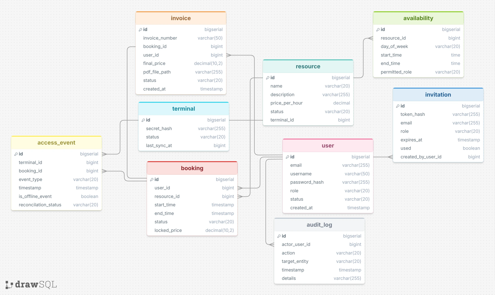

# Database Schema & Entity Design (Spike T-001)

This document describes the initial relational database schema for the NFC-based terminal and booking system. The entity definitions and relationships are directly derived from the functional requirements (FR).

## 1. Core Entities

### User
* **Attributes:** `id`, `email`, `username`, `password_hash`, `role` (VARCHAR), `status` (VARCHAR), `created_at`
* **Traceability:** FR-01.01 to FR-01.04 (Role management, authentication, user administration).

### Invitation / PasswordResetToken
* **Attributes:** `id`, `token_hash`, `email`, `role` (VARCHAR), `expires_at`, `used` (BOOLEAN), `created_by_user_id` (FK)
* **Traceability:** FR-01.02 & FR-01.05 (Single-use, expiring registration and password-reset links).

### Resource
* **Attributes:** `id`, `name`, `description`, `price_per_hour`, `status` (VARCHAR), `terminal_id` (FK, UNIQUE)
* **Traceability:** FR-03.01 & FR-03.02 (Management and status tracking of bookable assets/rooms).

### Availability / AvailabilityRole
* **Attributes (Availability):** `id`, `resource_id` (FK), `day_of_week`, `start_time`, `end_time`, `permitted_role` (VARCHAR)
* **Traceability:** FR-01.07 & FR-03.01 (Configurable time windows and role-based access restrictions).

### Booking
* **Attributes:** `id`, `user_id` (FK), `resource_id` (FK), `start_time`, `end_time`, `status` (VARCHAR), `locked_price`
* **Traceability:** FR-04.01 to FR-04.04 (Booking creation, lifecycle states, price snapshotting).

### Terminal
* **Attributes:** `id`, `secret_hash`, `status` (VARCHAR), `last_sync_at`
* **Traceability:** FR-05.05 & FR-05.06 (Hardware reader assignment, key storage, sync tracking).

### AccessEvent
* **Attributes:** `id`, `booking_id` (FK), `terminal_id` (FK), `event_type` (VARCHAR), `timestamp`, `is_offline_event` (BOOLEAN), `reconciliation_status` (VARCHAR)
* **Traceability:** FR-05.02 to FR-05.04 (Check-in/out event logging and offline reconciliation).

### Invoice
* **Attributes:** `id`, `invoice_number`, `booking_id` (FK, UNIQUE), `user_id` (FK), `final_price`, `pdf_file_path`, `status` (VARCHAR), `created_at`
* **Traceability:** FR-06.01 to FR-06.04 (Automated cost calculation and invoice generation).

### AuditLog
* **Attributes:** `id`, `actor_user_id` (FK), `action`, `target_entity`, `timestamp`, `details`
* **Traceability:** FR-07.03 & FR-07.04 (Immutable audit log for security and operational events).

---

## 2. Key Relationships & Cardinalities

* **User $\rightarrow$ Booking ($1 : n$):** A single user can create multiple bookings over time.
* **Resource $\rightarrow$ Booking ($1 : n$):** A resource holds multiple scheduled bookings.
* **Terminal $\rightarrow$ Resource ($1 : 1$):** Each terminal is assigned to exactly one physical resource.
* **Booking $\rightarrow$ AccessEvent ($1 : n$):** A booking typically contains a check-in and a check-out access event.
* **Booking $\rightarrow$ Invoice ($1 : 1$):** Every completed booking links to exactly one billing invoice.